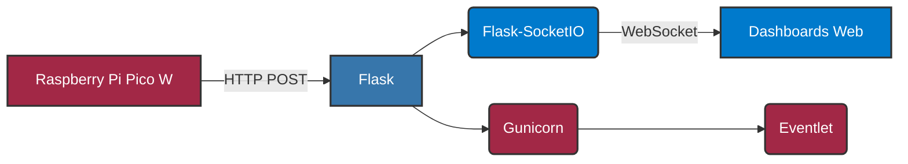
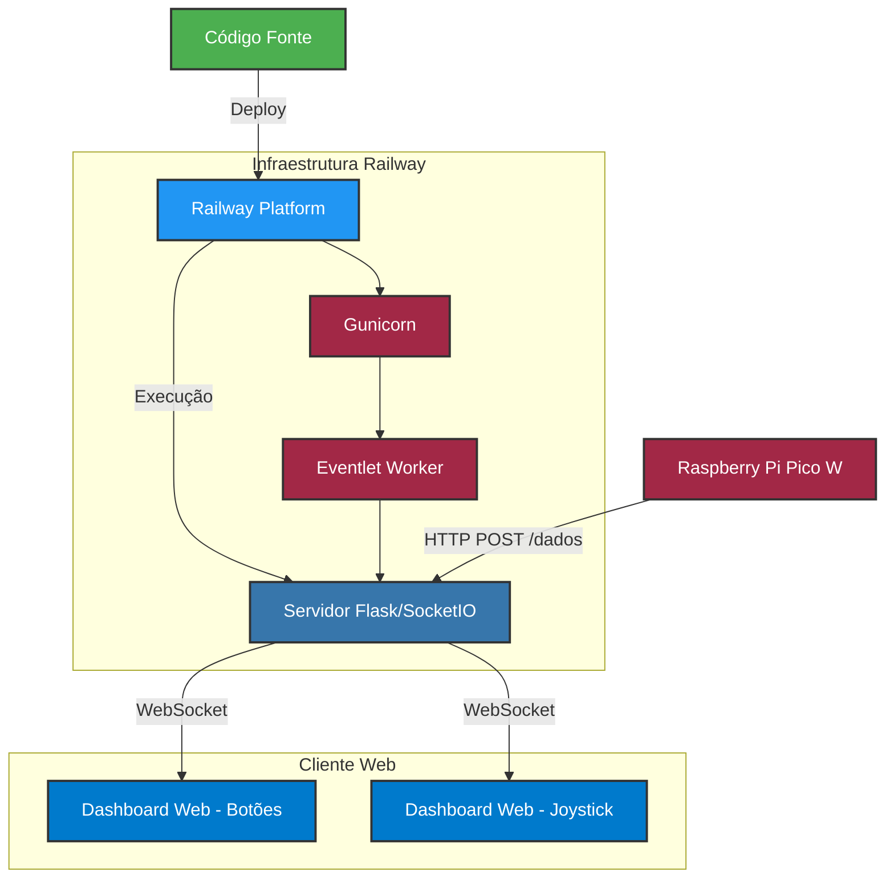

# Servidor Backend para Projeto IoT com Raspberry Pi Pico W

Este documento descreve a aplicação do servidor backend construída com Python e Flask, responsável por receber dados dos dispositivos Raspberry Pi Pico W e transmiti-los em tempo real para os dashboards web.

## Sumário

1.  [Visão Geral](#1-visão-geral)
2.  [Arquitetura](#2-arquitetura)
3.  [Tecnologias Utilizadas](#3-tecnologias-utilizadas)
4.  [Configuração e Implantação](#4-configuração-e-implantação)
    *   [Pré-requisitos](#41-pré-requisitos)
    *   [Instalação das Dependências](#42-instalação-das-dependências)
    *   [Configuração no Railway](#43-configuração-no-railway)
5.  [Endpoints da API](#5-endpoints-da-api)
6.  [Estrutura dos Dados](#6-estrutura-dos-dados)
7.  [Customização e Extensão](#7-customização-e-extensão)
8.  [Diagrama de Deploy](#8-diagrama-de-deploy)

---

## 1. Visão Geral

O servidor backend é uma aplicação web construída com o microframework Flask em Python. Ele atua como um ponto central de comunicação entre os dispositivos Raspberry Pi Pico W e os dashboards web. O servidor recebe dados dos dispositivos via requisições HTTP POST, processa esses dados e os retransmite em tempo real para os clientes web (dashboards) utilizando WebSockets, através da biblioteca Flask-SocketIO.

## 2. Arquitetura

A arquitetura do servidor é simples e modular:

*   **Flask:** Lida com o roteamento das requisições HTTP e o serviço de arquivos estáticos (HTML, CSS, JavaScript).
*   **Flask-SocketIO:** Permite a comunicação bidirecional em tempo real entre o servidor e os clientes web.
*   **Gunicorn (com Eventlet):** Servidor WSGI para implantação em produção, utilizando o worker Eventlet para compatibilidade com Socket.IO.



## 3. Tecnologias Utilizadas

*   [Python 3.8+](https://www.python.org/)
*   [Flask](https://flask.palletsprojects.com/): Microframework web para Python.
*   [Flask-SocketIO](https://flask-socketio.readthedocs.io/): Integração de Socket.IO com Flask.
*   [Gunicorn](https://gunicorn.org/): Servidor WSGI para implantação.
*   [Eventlet](https://eventlet.net/): Biblioteca para concorrência (necessária para Socket.IO com Gunicorn).

## 4. Configuração e Implantação

### 4.1. Pré-requisitos

*   Python 3.8 ou superior instalado.
*   `pip` (gerenciador de pacotes Python).
*   Conta na plataforma [Railway](https://railway.app/) (opcional, mas recomendado para implantação fácil).

### 4.2. Instalação das Dependências

Navegue até o diretório `/servidor_railway` e execute o seguinte comando para instalar as dependências:

```bash
pip install -r requirements.txt
```

O arquivo `requirements.txt` deve conter as seguintes dependências:

```txt
flask
flask-socketio
eventlet
gunicorn
```

### 4.3. Configuração no Railway

Para implantar o servidor no Railway, siga estas etapas:

1. **Crie uma conta** ou **faça login** na plataforma [Railway](https://railway.app/).
2. Selecione **New Project** e escolha **Deploy from GitHub repo**.
3. Selecione o repositório que contém o código do servidor.
4. O Railway detectará automaticamente o `Procfile` e configurará o deploy.
5. Não são necessárias variáveis de ambiente adicionais, mas você pode configurá-las caso precise de customizações específicas.
6. Clique em **Deploy** para iniciar o processo de implantação.

O Procfile já está configurado para usar o Gunicorn com o worker Eventlet necessário para o Flask-SocketIO:

```txt
web: gunicorn -k eventlet -w 1 app:app
```

Uma vez implantado, o Railway fornecerá um URL para acesso ao seu servidor.

## 5. Endpoints da API

O servidor disponibiliza os seguintes endpoints:

| Endpoint | Método | Descrição |
|----------|--------|-----------|
| `/dados` | POST | Recebe dados dos dispositivos Raspberry Pi Pico W |
| `/dashboard/botoes` | GET | Interface web para visualização dos botões e temperatura |
| `/dashboard/joystick` | GET | Interface web para visualização do joystick |

### Detalhes dos Endpoints:

#### POST `/dados`
- **Função:** Receber dados dos dispositivos IoT
- **Formato de entrada:** JSON
- **Exemplo de requisição:**
  ```json
  {
    "button_a": 1,
    "button_b": 0,
    "temperature": 25.5
  }
  ```
  ou
  ```json
  {
    "x": 75,
    "y": 25
  }
  ```
- **Retorno:** `{"status": "ok"}` (HTTP 200) em caso de sucesso

## 6. Estrutura dos Dados

O servidor trabalha com dois formatos principais de dados:

### Dados dos Botões e Temperatura

```json
{
  "button_a": 0|1,         // 0=solto, 1=pressionado
  "button_b": 0|1,         // 0=solto, 1=pressionado
  "temperature": float     // Temperatura em graus Celsius
}
```

### Dados do Joystick

```json
{
  "x": int,    // Posição no eixo X (0-100)
  "y": int     // Posição no eixo Y (0-100)
}
```

Os dados são enviados pelos dispositivos Raspberry Pi Pico W através de requisições HTTP POST e são armazenados temporariamente no servidor. Os clientes web recebem esses dados em tempo real via WebSockets.

## 7. Customização e Extensão

O servidor foi projetado para ser facilmente expansível. Algumas possibilidades de customização:

### Adição de Novos Sensores

Para adicionar um novo tipo de sensor:

1. Modifique a estrutura de dados no arquivo `app.py` para incluir o novo sensor na variável `ultimo_dado`.
2. Crie ou atualize os templates HTML em `/templates` para exibir os novos dados.
3. Adicione a lógica JavaScript necessária em `/static/js` para processar os dados do novo sensor.

### Personalização da Interface

Os estilos da interface estão separados nos arquivos CSS em `/static/css`:

- `botoes.css` para a interface de botões e temperatura
- `joystick.css` para a interface do joystick

Você pode modificar estes arquivos para personalizar a aparência das páginas.

### Implementação de Autenticação

Para adicionar autenticação aos endpoints:

1. Instale o Flask-Login: `pip install flask-login`
2. Adicione a configuração no arquivo `app.py`
3. Crie uma página de login e atualize os endpoints para exigir autenticação

## 8. Diagrama de Deploy

O diagrama abaixo mostra o fluxo completo de deploy e comunicação entre os componentes do sistema:



Este diagrama ilustra como os dados fluem desde o dispositivo Raspberry Pi Pico W até os dashboards web, passando pela infraestrutura do Railway que executa o servidor Flask com WebSockets.

